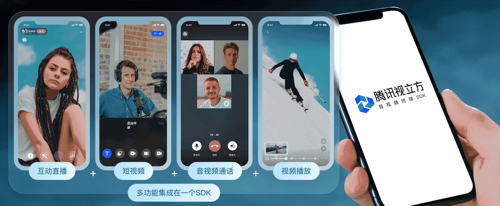

_[简体中文](README.zh.md) | English_

## Tencent Cloud Media Services 

Tencent Cloud provides a one-stop audio/video solution covering video calls， live streaming, real-time communication, video-on-demand,short video, instant messaging, media processing servic, and more. 

Industry-leading technologies provide a competitive edge in entertainment, social networking, education, gaming, live streaming, and other applications

- Visit [our website](https://www.tencentcloud.com/products/media/) to learn about our products
- Read [our documentation](https://www.tencentcloud.com/document/product/647/39386) to learn how to implement our features

### Our API-Example for multiple platforms

Choose the functionality you need, then choose the platform to download the api-example.

> ### Real-Time Rooms 
>
> Build your real-time rooms or video meetting globally within 30 minutes. 
> 
> [[Web SDK](https://github.com/LiteAVSDK/TRTC_Web)]
[[Android SDK](https://github.com/LiteAVSDK/TRTC_Android)]
[[iOS SDK](https://github.com/LiteAVSDK/TRTC_iOS)]
[[React native](https://github.com/LiteAVSDK/TRTC_Windows)]
[[Flutter](https://github.com/LiteAVSDK/TRTC_Mac)]
[[React native](https://github.com/LiteAVSDK/TRTC_ReactNative)]
[[Flutter](https://github.com/LiteAVSDK/TRTC_Flutter)]
[[TRTC_Electron](https://github.com/LiteAVSDK/TRTC_Electron)]

> ### Live Streaming
>
> A quick integration solution to push and pull live streams on mobile devices.
>
> [[Android SDK](https://github.com/LiteAVSDK/Live_Android)]
> [[iOS SDK](https://github.com/LiteAVSDK/Live_iOS)]

> ### Video Editor
>
> Create short video mobile applications easily.
>
>[[Android SDK](https://github.com/LiteAVSDK/UGSV_Android)]
> [[iOS SDK](https://github.com/LiteAVSDK/UGSV_iOS)]

### Our UIkits for multiple platforms

> ### UIKit for video calls
>
> Implement a audio&video calls application with multiple features, such as group call, muting microphone, offline call, custom ringtone etc.
> 
> [[Web SDK](https://github.com/tencentyun/TUICallKit/tree/main/Web)]
[[iOS SDK](https://github.com/tencentyun/TUICallKit/tree/main/iOS)]
[[Android SDK](https://github.com/tencentyun/TUICallKit/tree/main/Android)]
[[MiniProgram SDK](https://github.com/tencentyun/TUICallKit/tree/main/MiniProgram)]
